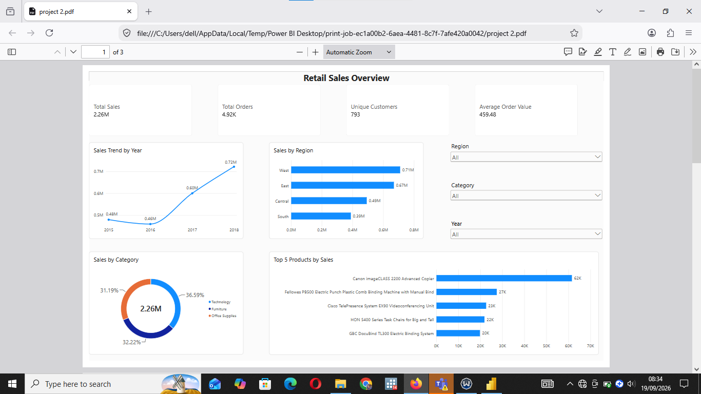
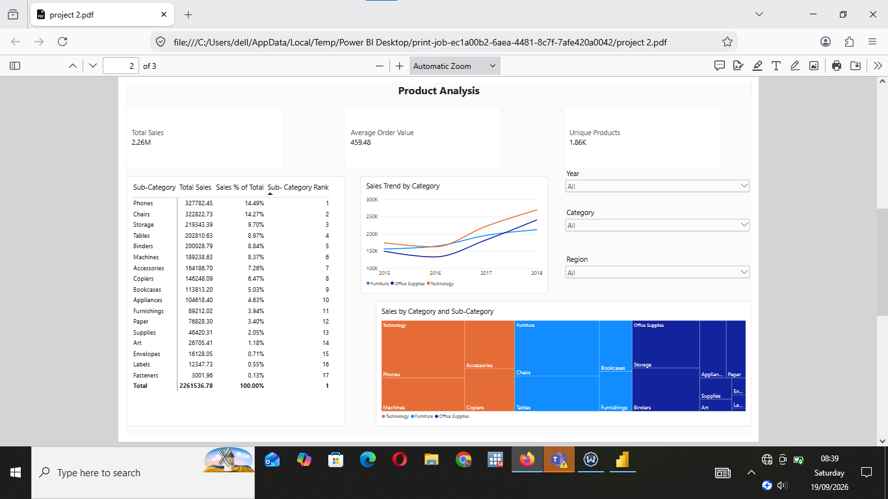
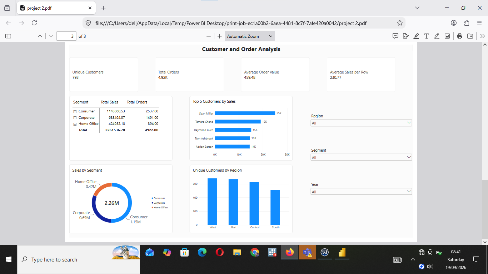

# Retail Sales Analysis & Interactive Power BI Dashboard
## Business Question

How can retail sales data be analyzed to understand sales trends, product performance, customer patterns, and regional performance, and what insights can support better business decisions?

## Headline Results

- Total sales were approximately **$2.26M** across **9,800 sales records** and **4,922 unique orders**.
- **Technology** recorded the highest sales among the three major categories.
- **Phones** was the highest-selling sub-category.
- Annual sales declined slightly from **2015 to 2016**, then increased substantially in **2017 and 2018**.
- **2018 recorded the highest annual sales**, at approximately **$722K**.
- **Q4 2018** recorded the highest quarterly sales, at approximately **$278K**.

## Project Overview

This project analyzes retail sales data to identify sales trends, product performance, customer patterns, and regional sales performance. The project involved cleaning and preparing the dataset with Python and building an interactive Power BI dashboard to explore the data and communicate key findings.

## Project Objectives

The main objectives of this project were to:

- Analyze overall retail sales performance
- Identify sales trends over time
- Examine product and sub-category performance
- Analyze customer and segment patterns
- Compare sales performance across regions
- Build an interactive dashboard to communicate insights

## Tools Used

- **Python** — Data validation, Data cleaning and preparation
- **Excel** — Data inspection and preliminary analysis
- **Power BI** — Data modeling, DAX, analysis, and visualization

## Dataset

The dataset contains **9,800 retail sales records and 18 columns** covering information about:

- Orders
- Customers
- Products
- Categories and sub-categories
- Dates
- Shipping methods
- Locations
- Sales

The dataset was cleaned and prepared before being used for analysis.It covers 4,922 orders from 793 customers in the United States between January 2015 and December 2018. It contains sales values only: there are no profit, discount or quantity columns, so profitability cannot be assessed.

Dataset Source:
[https://www.kaggle.com/datasets/rohitsahoo/sales-forecasting]

**Data Dictionary**
|Column|Descriptions |
| --- |---: |
|Row ID | Unique row number |
| Order ID | Order identifier (one order can have several rows) |
|Order Date, Ship Date | Dates the order was placed and shipped |
|Ship Mode | Standard Class, Second Class, First Class or Same Day |
|Customer ID, Customer Name | Customer identifiers |
| Segment | Consumer, Corporate or Home Office |
| Country, State, City, Postal Code | Delivery location(United States only) |
| Region | West, East, Central or South |
| Product ID, Product Name | Product identifiers|
| Category, Sub-Category | 3 categories and 17 sub-categories
| Sales | value of the line item |


## Data Cleaning
Python was used to validate and clean the dataset
 The original file was left unchanged, and the cleaned version was saved as cleaned_retail_sales.csv.
| Check | Result | Action |
| --- | ---: | ---: |
| Missing values | 11 missing postal codes (all in Vermont) | Replaced with "unknown". Rows were kept because the rest of each record is valid |
| Date columns | Stored as text | Converted to datetime format. No ship date falls before its order date |
| Text columns | Possible leading and trailing spaces | Trimmed |
| Negative sales | None found | No action needed |
| Duplicates | No fully duplicate rows. One pair (Row IDs 3406 and 3407) is identical except for Row ID | Both rows kept, since there is no quantity column to show whether it is a repeated purchase |
| Sales outliers | 1,145 rows flagged by the IQR method | Kept. Sales are highly skewed (median $54 vs mean $231), so large orders are genuine values, not data-entry errors |

After cleaning, the dataset still contains 9,800 rows and 18 columns.

## Analysis Performed

**Sales Performance**
- Total sales
- Sales trends by year
- Sales by region
- Sales by category
- Sales growth over time

**Product Analysis**
- Sales by sub-category
- Top-performing products
- Sales contribution by sub-category
- Category and sub-category performance
- Product ranking

**Customer & Order Analysis**
- Number of unique customers
- Number of orders
- Average order value
- Sales by customer segment
- Orders by region
- Sales by shipping mode

## Power BI Dashboard
The Power BI report contains three analysis pages. The screenshots below show each page. To interact with the dashboard, download 
 and open it in Power BI Desktop (free, Windows). Use the slicers and click any chart element to cross-filter the page.

### Page 1 — Sales Overview
Provides a high-level view of sales performance.

Key features include:
- Total Sales
- Total Orders
- Average Order Value
- Unique Customers
- Sales trend by year
- Sales by region
- Top 5 products by sales
- Sales by category
- Interactive slicers for Year, Region, and Category
  
**Insight:** 2018 was the strongest year($722k), and Technology is a leading category(36.6% of sales)
  


### Page 2 — Product Analysis
Focuses on product and sub-category performance.

Key features include:
- Sales by sub-category
- Unique products 
- Sales percentage by sub-category
- Category and sub-category breakdown
- Category sales trends
- Interactive slicers for Category, Year,and Region

**Insight:** Phones ($328K) and Chairs ($323K) are the top two sub-categories, together making up 28.8% of sales.



### Page 3 — Customer & Order Analysis
Focuses on customer and order patterns.

Key features include:
- Unique customers
- Total orders
- Average order value
- Average sales per row
- Sales by customer segment
- Orders by region
- Customers by region
- Sales by shipping mode
- Customer and segment details



## DAX & Data Modeling

DAX was used to create reusable measures and perform calculations such as:

- Total Sales
- Total Orders
- Average Order Value
- Unique Customers
- Unique Products
- Sales % of Total
- Sub-category Ranking
- Previous Year Sales
- Sales Growth %

A dedicated Date Table was also created and related to the sales data to support time-based analysis.

## Key Findings

- **Overview:** $2.26M in sales across 4,922 orders and 793 customers (Jan 2015 – Dec 2018). Average order value: $459.
- **Growth:** Sales dipped 4.3% in 2016 ($459K), then rose 30.6% in 2017 ($600K) and 20.3% in 2018 ($722K), which is 50% above 2015.
- **Growth came from order volume, not basket size:** Orders grew 75% (947 → 1,661) while average order value fell from about $507 to $435.
- **Categories:** Technology leads with $827K (36.6%), followed by Furniture (32.2%) and Office Supplies (31.2%).
- **Sub-categories:** Phones ($328K, 14.5%) and Chairs ($323K, 14.3%) make up 28.8% of sales together. The four smallest sub-categories (Art, Envelopes, Labels, Fasteners) total just 2.5%.
- **Seasonality:** Q4 brings in 38.5% of all sales, versus 15.5% in Q1. November ($350K), December ($321K) and September ($300K) are the strongest months, and February is the weakest ($59K).
- **Regions:** West (31.4%) and East (29.6%) generate 61% of sales. South fell 32% in 2016 before recovering. Central slipped 2.8% in 2018 while every other region grew.
- **States:** California ($446K) and New York ($306K) account for 33% of sales.
- **Segments:** Consumer 50.8%, Corporate 30.4%, Home Office 18.8%.
- **Shipping:** Standard Class carries 59.3% of sales, and the average delivery time is about 4 days.
- **Products:** The top product is the Canon imageCLASS 2200 Advanced Copier ($61.6K, 2.7%). The top 10 products make up only 10.8% of sales, so revenue isn't reliant on a few items.

## Recommendations

- Plan stock and promotions ahead of September to December.
- Since growth comes from more orders, test bundles or upsells to lift order value.
- Investigate Central's 2018 slowdown.
- Prioritize Technology, Phones and Chairs, and review the sub-categories that barely contribute.

## Limitations

The data has no profit, discount or quantity columns, so profitability can't be assessed.

## Skills Demonstrated

This project demonstrates practical experience with:

- Data cleaning with Python
- Data exploration
- Power Query
- Data modeling
- Relationships
- Date tables
- DAX
- Measures
- Time intelligence
- RANKX
- Top-N analysis
- Hierarchies
- Drill-down and drill-up
- Slicers and filters
- Conditional formatting
- Interactive dashboard design
- Data storytelling

## Project Structure

```text
retail-sales-analysis/
├── README.md
├── data/
│   └── cleaned_retail_sales.csv
├── powerbi/
│   └── retail_sales_dashboard.pbix
├── screenshots/
│   ├── page1_overview.png
│   ├── page2_product_analysis.png
│   └── page3_customer_analysis.png
└── python/
    └── data_cleaning.ipynb
```

## Conclusion

This project demonstrates an end-to-end retail sales analysis workflow, from data cleaning and preparation to data modeling, analysis, visualization, and interactive dashboard development.
